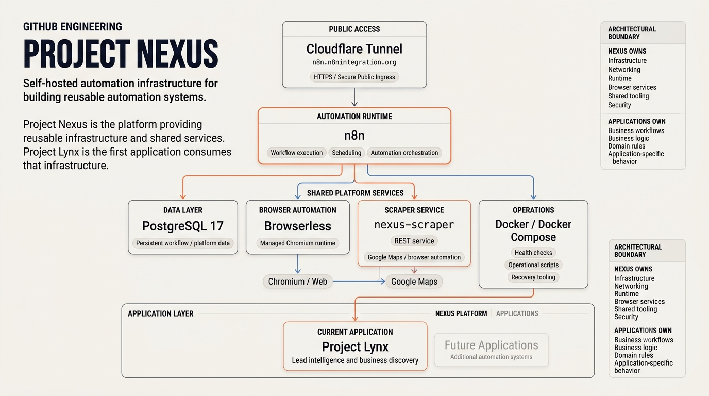

# Project Nexus

> **Self-hosted automation infrastructure for building reusable automation systems.**

Project Nexus is a self-hosted infrastructure platform designed to provide a reusable foundation for automation projects.

Instead of rebuilding networking, databases, browser automation, workflow execution, public ingress, and operational tooling for every project, Nexus provides these capabilities as shared platform infrastructure.

The platform is designed around a simple distinction:

> **Nexus is the platform. Applications are built on top of it.**

The first application being developed on Nexus is **Project Lynx** - a lead-intelligence system designed to discover businesses, collect relevant information, audit their digital presence, qualify opportunities, and support personalized outreach.

---

## 01 - Why Nexus Exists

Automation projects often begin with a workflow and gradually accumulate infrastructure around it:

* workflow orchestration
* databases
* browser automation
* scraping services
* networking
* authentication
* public access
* logging
* health checks
* operational scripts
* recovery procedures

Building these components repeatedly creates unnecessary engineering work.

Nexus separates the reusable infrastructure from the individual application.

```text
                         PROJECT NEXUS
                              |
       +----------------------+----------------------+
       |                      |                      |
   Networking             Data Layer          Automation
       |                      |                      |
 Cloudflare              PostgreSQL               n8n
   Tunnel                    |                      |
       |                      |                      |
       +----------------------+----------------------+
                              |
                    Shared Platform Services
                              |
                 +------------+------------+
                 |                         |
          Browser Runtime            Operational
          Browserless +              Tooling
          nexus-scraper              Health / Scripts
                 |                         |
                 +------------+------------+
                              |
                         Applications
                              |
                         Project Lynx
```

This allows future applications to inherit the same foundation instead of creating another isolated infrastructure stack.

---

## 02 - Platform Architecture

Nexus currently consists of several cooperating layers.



*Current platform architecture - Project Nexus*

### Public Ingress

**Cloudflare Tunnel** provides secure public access to the platform without directly exposing the underlying host.

```text
Internet
    |
    v
Cloudflare
    |
    v
Cloudflare Tunnel
    |
    v
n8n : 5678
```

The current public endpoint is:

`https://n8n.n8nintegration.org`

The tunnel uses a remotely managed configuration and an environment-provided connector token rather than storing tunnel credentials inside the repository.

---

### Automation Runtime

**n8n** provides the workflow orchestration layer.

It acts as the execution environment where automation workflows can coordinate external services, APIs, databases, and Nexus platform components.

---

### Data Layer

**PostgreSQL 17** provides persistent relational storage for the platform.

The database is containerized and managed as part of the Nexus infrastructure rather than being tied to a particular application.

---

### Browser Automation Layer

Nexus uses **Browserless** as the browser execution environment.

A dedicated `nexus-scraper` REST service provides a controlled interface between automation workflows and browser-based data collection.

Conceptually:

```text
n8n
 |
 v
nexus-scraper
 |
 v
Browserless
 |
 v
Chromium
 |
 v
Target website
```

This separation keeps browser execution independent from workflow orchestration and allows the browser layer to evolve without redesigning the entire platform.

---

## 03 - Applications

### Project Lynx

**Project Lynx** is the first application being built on Nexus.

Its purpose is to provide lead intelligence for business-prospecting workflows.

The intended pipeline includes:

```text
Business Discovery
       |
       v
Data Collection
       |
       v
Website / Digital Presence Analysis
       |
       v
Lead Qualification
       |
       v
Opportunity Intelligence
       |
       v
Personalized Outreach Preparation
```

Lynx is an application.

Nexus is the infrastructure that makes applications like Lynx possible.

Future applications can reuse the same platform services.

---

## 04 - Current Platform Stack

| Layer                  | Technology               | Purpose                             |
| ---------------------- | ------------------------ | ----------------------------------- |
| Workflow orchestration | n8n                      | Automation execution                |
| Database               | PostgreSQL 17            | Persistent relational storage       |
| Public ingress         | Cloudflare Tunnel        | Secure external access              |
| Browser execution      | Browserless              | Managed browser runtime             |
| Scraping service       | `nexus-scraper`          | Browser automation interface        |
| Containers             | Docker / Docker Compose  | Service isolation and orchestration |
| Host environment       | Windows + Docker Desktop | Development environment             |
| Source control         | Git / GitHub             | Version control and collaboration   |

---

## 05 - Repository Structure

```text
Project-Nexus/
|
+-- docs/
|   +-- architecture/
|   +-- development/
|   +-- recovery/
|   +-- ...
|
+-- infrastructure/
|   +-- compose/
|   +-- cloudflare/
|
+-- services/
|   +-- nexus-scraper/
|
+-- scripts/
|   +-- docker/
|   +-- ...
|
+-- PROJECT_BIBLE.md
+-- README.md
+-- .gitignore
```

Sensitive runtime configuration and local environment files are intentionally excluded from version control.

---

## 06 - Engineering Principles

Nexus is being developed around several principles.

### Platform before applications

Build reusable infrastructure before repeatedly rebuilding it inside individual projects.

### Automation before unnecessary complexity

Prefer deterministic infrastructure and automation over adding technology simply because it is available.

### Modular services

Services should have clear responsibilities and communicate through explicit interfaces.

### Reproducibility

Infrastructure should be describable through version-controlled configuration rather than undocumented manual setup.

### Security by default

Credentials, environment configuration, and local runtime artifacts should remain outside source control.

### Documentation as infrastructure

Architecture, operational procedures, recovery instructions, and engineering decisions are treated as part of the platform rather than optional documentation.

### Simplicity over unnecessary abstraction

The platform should become more capable without becoming unnecessarily complicated.

---

## 07 - Security Model

Nexus is designed so that sensitive runtime credentials do not need to live in the repository.

Environment-specific secrets are provided through local environment configuration and excluded from Git.

Cloudflare Tunnel authentication currently uses an environment-provided connector token.

The repository also explicitly ignores Cloudflare credential JSON files:

```text
infrastructure/cloudflare/config/*.json
```

This prevents local tunnel credential files from accidentally becoming part of the tracked repository.

---

## 08 - Operational Design

Nexus is intended to be operated as infrastructure rather than as a collection of manually started applications.

Docker Compose definitions provide the service topology.

Operational scripts provide repeatable commands for common tasks.

Health checks and service-level diagnostics help verify that individual components are functioning correctly.

The platform also maintains recovery and architecture documentation so that rebuilding the environment does not depend entirely on undocumented knowledge.

---

## 09 - Development Status

**Current Stage: Automation Runtime**

### Completed

* Foundation infrastructure
* Containerized service architecture
* PostgreSQL integration
* n8n workflow runtime
* Cloudflare public ingress
* Custom domain routing
* Browser automation infrastructure
* Browserless integration
* Dedicated `nexus-scraper` service
* Operational scripts
* Architecture and recovery documentation
* Git-based infrastructure management

### In Progress

* Expanding shared browser automation capabilities
* Project Lynx integration
* Additional reusable platform services
* Operational hardening
* Production-oriented reliability improvements

---

## 10 - Roadmap

The long-term direction of Nexus is to evolve from a self-hosted automation stack into a reusable automation platform.

```text
                    +---------------------+
                    |   Project Nexus     |
                    |   Platform Layer    |
                    +----------+----------+
                               |
             +-----------------+-----------------+
             |                 |                 |
             v                 v                 v
        Project Lynx      Future App A      Future App B
             |                 |                 |
             +-----------------+-----------------+
                               |
                    Shared Infrastructure
```

The goal is not to build one increasingly complicated application.

The goal is to make the **next automation project cheaper and faster to build because the infrastructure already exists.**

---

## 11 - Documentation

The repository contains additional documentation covering:

| Area          | Purpose                                       |
| ------------- | --------------------------------------------- |
| Architecture  | Platform structure and technical decisions    |
| Development   | Engineering standards and workflows           |
| Recovery      | Rebuild and disaster-recovery procedures      |
| Project Bible | Long-term vision and platform principles      |
| Operations    | Service management and operational procedures |

The documentation will evolve alongside the infrastructure.

---

## 12 - Project Status

> **Active Development**

Project Nexus is currently evolving its automation runtime and integrating its first application, Project Lynx.

The platform is intentionally being developed incrementally: establish reliable infrastructure first, then build increasingly sophisticated automation systems on top of it.

---

## License

Project Nexus is currently a personal engineering project.

Licensing terms will be established before any formal public software release.
